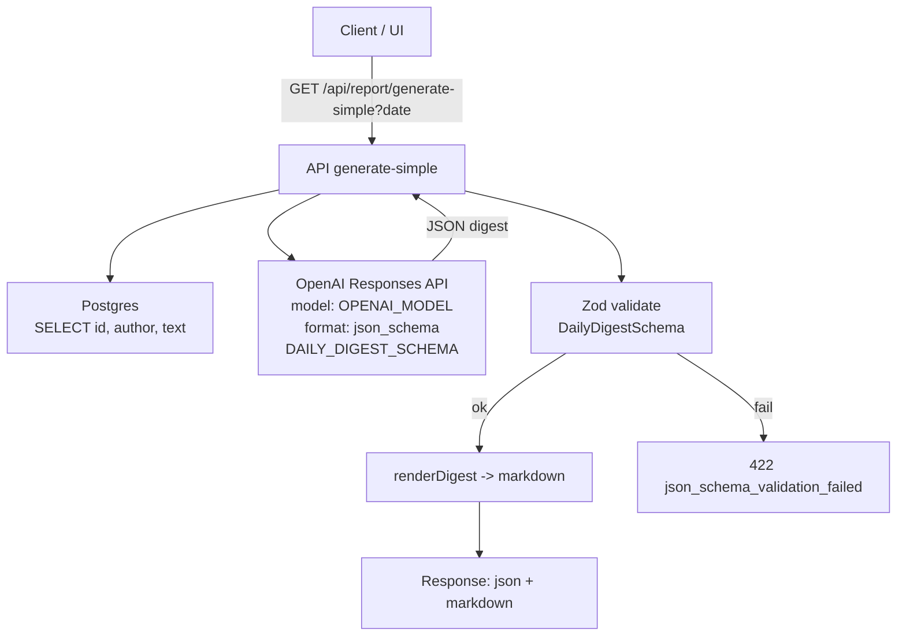

# Telegram Dashboard — последние 24 часа / 7 дней

Ультра‑MVP дэшборд для чтения из существующей Railway Postgres без миграций и лишних фич. Один сервер (Express + pg) и одна статика.

## Запуск локально

1) Node 18+
2) Скопируй `env.example` → `.env` и заполни `DATABASE_URL`.
3) Установи зависимости и стартуй:

```bash
npm i
npm start
```

Открой:
- 24 часа: http://localhost:3000/
- 7 дней: http://localhost:3000/week.html

## Переменные окружения

- DATABASE_URL — строка подключения Railway (postgresql://...)
- PORT — порт (по умолчанию 3000)
- PGSSL — если SSL не нужен, установи `PGSSL=disable`

Пример см. в `env.example`.

## API

- GET `/api/overview` — последние 24 часа
- GET `/api/overview?days=7` — окно в днях (1..30)

Ответ содержит:
- `kpi` — total, unique, avg_per_user, replies, with_links
- `hourly` — почасовые группы
- `daily` — дневные группы (при `days>1`)
- `topUsers`, `topLinks`, `topWords`, `topThreads`
- `since`, `until`, `window_days`, `summaryBullets`

Все запросы считают окно времени на сервере и фильтруют по `sent_at`.

## Стек

- Node.js + Express + pg
- Один процесс, без Docker/миграций/аутентификации/логов и т. п.
- UI: простая статика + Chart.js через CDN

## Деплой (пример Railway/Vercel/Render)

- Нужен Node 18+, запусти команду `npm start`
- Прокинь `DATABASE_URL`, при необходимости `PGSSL=disable`

## Примечания

- Имя пользователя выводится как `Имя Фамилия (@username)`, если доступно.
- Из БД используются поля таблиц:
  - `messages(message_id, chat_id, user_id, text, sent_at, raw_message)`
  - `users(id, first_name, last_name, username)`
- Replies считаются по ключу `raw_message -> reply_to_message`.

## Диаграмма потока данных (простой дайджест)



## Тест GPT‑5

Пайплайн реализован и проверен GPT‑5. Быстрые проверки:

- `npm run smoke:openai` — проверка Responses API и строгого JSON вывода
- `npm run smoke:digest` — проверка схемы DAILY_DIGEST_SCHEMA на минимальном примере

